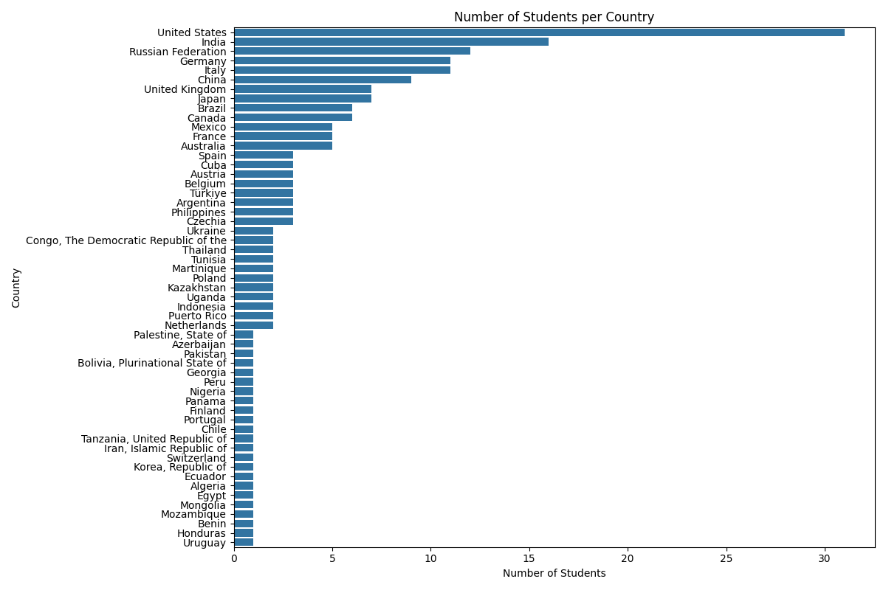
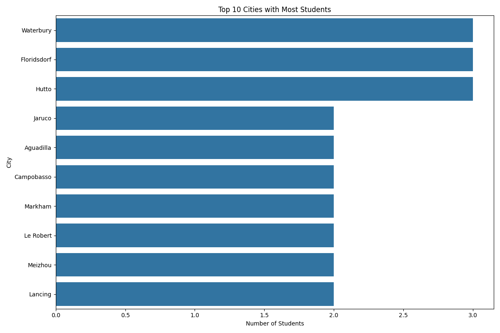
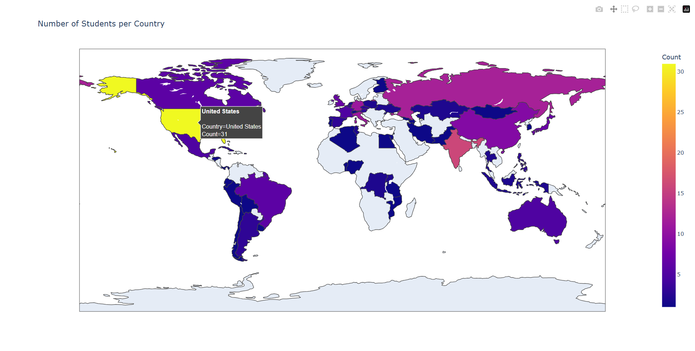
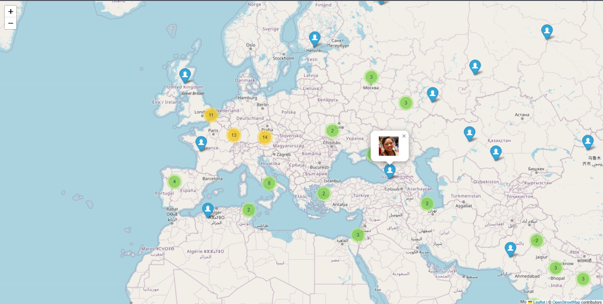

# Overall

For data simulation I was using faker to create a data with country, city, latitude and longitude.
And random avatars from `pravatar` API.

I have two charts:
* Number of students in country

* Top 10 countries with most students

And two maps:
* Number of students per country (heatmap)

* Map with pinpoint of every student
